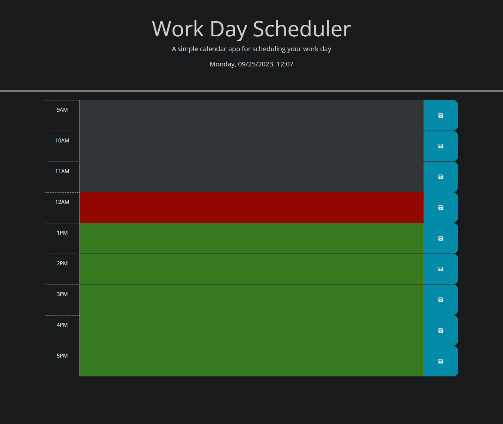
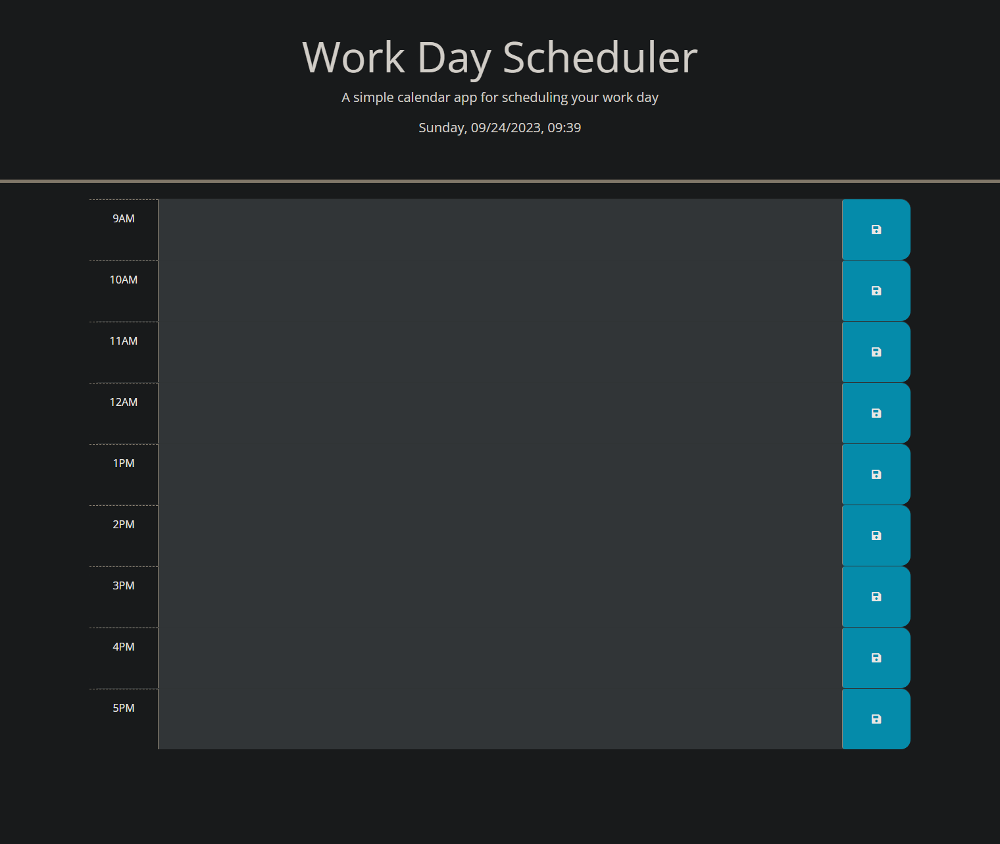

## Work-Day-Scheduler

## Description
This project was all about learning and using javascript in conjuction with jquery to create and run some functions that would run some already established operations.
The bulk of the code was provided to me on both the html and css.  I was just tasked with cleaning up the html and also to populate some new fields to populate the page I was creating. 
My main task came on the javascript page.  I was tasked with writing several different functions.  I not only had to develop a way for the page to communicate with the users settings in order
to establish a time and display it for them.  I also needed to make it so that the user could input data that would be saved, upon user hitting any save button, that would stay on that page until
they decided to reset that data.  Very useful for a daily planner, as you can populate it in the morning, and whether you need to restart the pc or leave the office, the information will still 
be available to you when you refresh or even reload the page. The next time I build something like this I'd like to also dig into resetting that local storage based on a time frame, or at least
give the user an option to clear it themselves via an onscreen button or prompt.

Another part of this project was working with some of the values with the CSS and making it so our schedule would be a color coded.  This involved us using some functions that would not only allow
us to change some info on the HTML page via a script we wrote, but to also have some of those items be defined by a specific users timeframe.  When I initially finished this project I finished it
after hours, and I'd like to in the future figure out how I can either mainipulate my own time via a browser extension, or even through some additional coding.  I made sure to check it during the hours
presented on the page, so that I could demonstrate and fully test the features.  

## Installation
Deployed at https://slemjosh.github.io/work-day-scheduler/

## Usage

## Credits
https://www.freecodecamp.org/news/javascript-date-time-dayjs/#:~:text=const%20currentDate%20%3D%20dayjs()%3B,That's%20it!
https://day.js.org/docs/en/display/format
These sites helped me a lot with the basics of defining what time it is, and in addition to helping me display that information and use it on my page.

A large portion of the coding on this project was already done and provided for me by the UoU coding bootcamp 2023.
https://bootcamps.continue.utah.edu/

## License

Please refer to the LICENSE in the repo

